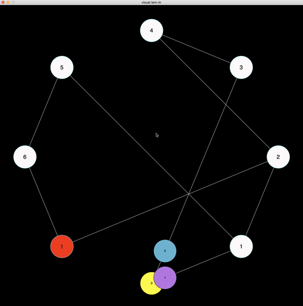

# python_graphics
Visualization of the algorithm for finding the optimal flow in the graph.

## В чем смысл?
Хотелось визуализации решения задачи нахождения оптимального потока в графе - она написана на питоне (лежит в bns), алгоритм на С.
Если не хочется читать, а хочется уже посмотреть на цветные двигающиеся кружочки, то стоит перейти сразу к "Как всем этим пользоваться?".

## А что за задача?
Дается карта (примеры лежат в maps) - в первой строке количество муравьев, которые нужно отправить из начала в конец муравьиной фермы. Далее идут вершины в формате "имя координата1 координата2", ##start и ##end отмечают следующую вершину как начало и конец соответственно. Далее идут ребра в формате "имявершины1-имявершины2". На этом графе и нужно найти путь для муравьев, чтобы все как можно быстрее добрались из начала в конец (за 1 ход муравей либо перемещается по одному ребру, либо остается сидеть в начальной/конечной вершине). 

Пример карты:
```
6
##start
s 4 0
1 4 2
2 4 4
3 2 2
4 0 4
5 8 2
6 8 4
##end
t 4 6
s-1
3-4
2-4
1-5
6-5
t-6
1-2
2-t
3-s
```

## Как всем этим пользоваться?
Если у вас *nix:
Клонируем репозиторий и компилим решение (которое на C):
```
git clone https://github.com/lesslim/python_graphics.git
cd python_graphics
make
```
Если модуль графики не установлен:
```
pip3 install --user http://bit.ly/csc161graphics
```
Запускаем:
```
./lem-in < maps/3 | python3 bns/v3.py
```
Должно выглядеть примерно вот так (нужно щелкнуть по окну для запуска):

В общем случае программа запуска выглядит так:
```
./lem-in < your_map_file | python3 bns/v3.py
```
Вместо v3.py можно использовать v4.py, v1.py, v2.py.

## Что реализовано?
Запуск программы как показано выше.
В v4.py и v1.py вершины располагаются по их координатам (данным в карте).
В v3.py и v2.py вершины располагаются по кругу (так более понятно, что происходит).
Все вершины подписаны своими именами, все муравьи своими номерами (в v3.py и v4.py у каждого еще и свой цвет).
После запуска программы по щелчку мышки по окну они начинают двигаться, по щелчку мышки останавливаются.
Выйти можно нажав на Esc или закрыв окно с визуализацией.
Карты без решения тоже поддерживаются (но там ничего не двигается, очевидно).
Новые карты можно генерировать генератором (но они большими получаются).


